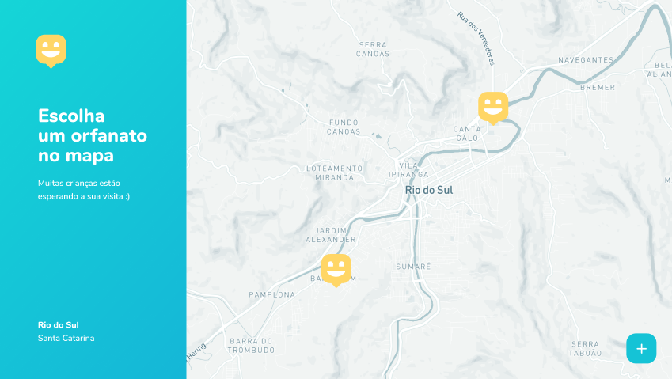
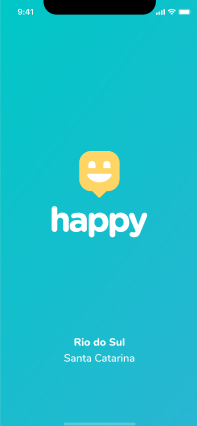

<h1 align="center"> 
    
</h1>

<h1 align="center">Happy</h1>

<h2 align="center" href="#">Demo</h2>

# Index

- [Index](#index)
  - [💻 Web](#-web)
  - [📱 Mobile](#-mobile)
  - [📋 About](#-about)
  - [⚙️ Technologies](#️-technologies)
  - [📥 Getting started](#-getting-started)
  

## 💻 Web

<h2 align="start"> 
    
    
</h2>

## 📱 Mobile

<h2>
    
    
</h2>

## 📋 About

The project **Happy** have an objective of connect people with orphanages. You could search it locals with extreme facility and usability. Go ahead! Make one children laughing.

Project development at **Next Level Week** event, by **Rocketseat**.

---

## ⚙️ Technologies 

- [Reactjs](https://reactjs.org/)
- [React Native](https://reactnative.dev/)
- [Nodejs](https://nodejs.org/en/docs/)

---

## 📥 Getting started

```bash

    # Clone repository
    $ git clone https://github.com/israelsantana01/happy.git

    # Select server folder
    $ cd happy/backend/

    # Start database
    $ npm start

    # Select web folder
    $ cd happy/web/

    # Start app in your browser
    $ npm start
```

---

Development by Israel da Silva Santana 😎
